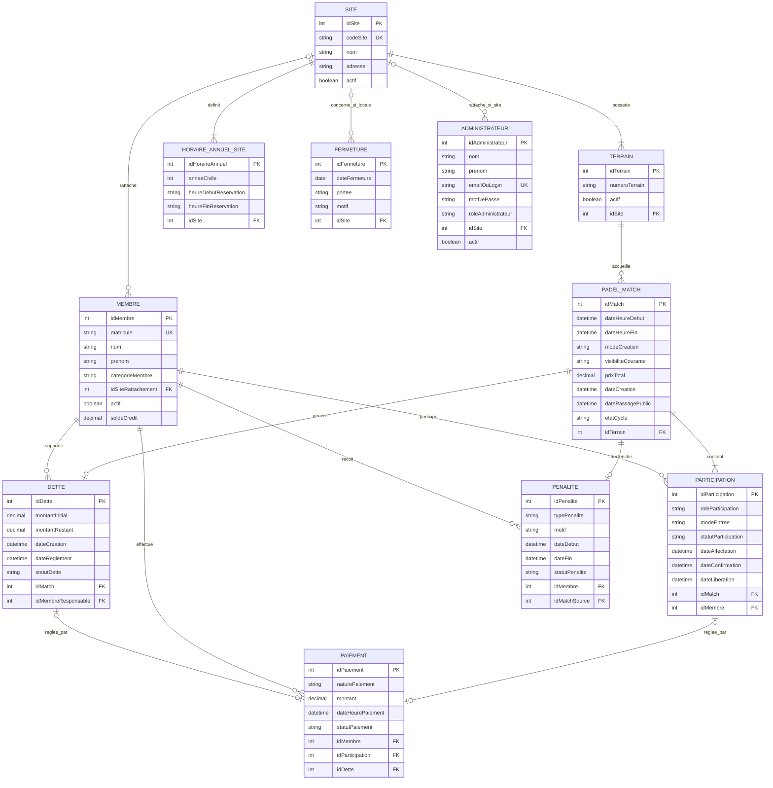

# Modélisation des données du MVP

Dernière mise à jour : 2026-05-25

## 1. Objectif du document

Ce document décrit les entités métier principales du MVP, leurs relations, leurs cardinalités et les contraintes métier importantes.

L’objectif est de maintenir une vision claire du modèle métier utilisé par le backend Spring Boot et par la base SQL relationnelle.

Ce document est volontairement fonctionnel : il explique les objets métier et leurs règles.  
Le schéma SQL détaillé est décrit dans `docs/04-modele-relationnel-sql.md`.

---

## 2. Choix de modélisation MVP

Le MVP utilise une modélisation simple et démontrable :

- un match est une réservation réelle d’un terrain ;
- un match est privé ou public ;
- une participation relie un membre à un match ;
- un paiement trace un encaissement métier ;
- une dette représente le solde dû par l’organisateur ;
- une pénalité bloque temporairement un organisateur ;
- le solde crédit joueur est porté directement par l’entité `Membre` via `soldeCredit`.

Point important :

```txt
Il n'y a pas de table séparée credit_portefeuille dans le modèle MVP actuel.
Le portefeuille virtuel est représenté par le champ soldeCredit du membre.
```

Ce choix reste simple pour l’examen :

- moins de tables ;
- modèle plus facile à expliquer ;
- paiement, dette et remboursement restent gérés dans les services backend ;
- le frontend n’accède jamais à la base et ne contient aucun SQL.

---

## 3. Entités métier

### 3.1. Site

**Rôle métier :** représente un club ou lieu d’exploitation.

**Informations importantes :**

- idSite
- codeSite
- nom
- adresse
- actif

**Règles principales :**

- un site peut avoir plusieurs terrains ;
- un site peut avoir ses propres horaires annuels ;
- un site peut avoir des jours de fermeture locaux ;
- un administrateur de site est limité à son site ;
- un membre `SITE` est rattaché à un site.

---

### 3.2. Terrain

**Rôle métier :** représente un terrain de padel réservable.

**Informations importantes :**

- idTerrain
- numeroTerrain
- actif
- site

**Règles principales :**

- un terrain appartient à un seul site ;
- un terrain inactif ne peut pas être réservé ;
- deux matches ne peuvent pas se chevaucher sur un même terrain ;
- il doit y avoir 15 minutes entre deux matches sur un même terrain.

---

### 3.3. HoraireAnnuelSite

**Rôle métier :** définit les heures de réservation d’un site pour une année civile.

**Informations importantes :**

- idHoraireAnnuel
- anneeCivile
- heureDebutReservation
- heureFinReservation
- site

**Règles principales :**

- les horaires sont propres à chaque site ;
- les horaires sont valables pour une année civile ;
- un couple `(site, année)` ne doit avoir qu’un seul horaire annuel ;
- les créneaux générés durent 1h30 ;
- une pause de 15 minutes est prévue entre les créneaux.

---

### 3.4. Fermeture

**Rôle métier :** représente un jour où les réservations sont impossibles.

**Informations importantes :**

- idFermeture
- dateFermeture
- portee (`GLOBALE` ou `LOCALE`)
- motif
- site optionnel

**Règles principales :**

- une fermeture globale concerne tous les sites ;
- une fermeture globale ne doit pas être rattachée à un site ;
- une fermeture locale concerne un seul site ;
- une fermeture locale doit être rattachée à un site ;
- une fermeture bloque les disponibilités ;
- une fermeture annule les matches à venir concernés ;
- une fermeture rembourse sur le solde crédit les joueurs qui avaient déjà payé.

---

### 3.5. Membre

**Rôle métier :** représente un joueur connu du système.

**Informations importantes :**

- idMembre
- matricule
- nom
- prenom
- categorieMembre (`GLOBAL`, `SITE`, `LIBRE`)
- siteRattachement optionnel
- actif
- soldeCredit
- motDePasseHash

**Règles principales :**

- le matricule est unique ;
- un joueur se connecte avec son matricule  + mot de passe ;
- pas de login ni mot de passe pour les joueurs ;
- un membre `GLOBAL` a un matricule de type `Gxxxx` ;
- un membre `SITE` a un matricule de type `Sxxxx` ;
- un membre `LIBRE` a un matricule de type `Lxxxx` ;
- un nouveau membre reçoit un solde crédit initial de `100.00` ;
- un membre `SITE` doit avoir un site de rattachement ;
- un membre `GLOBAL` ou `LIBRE` n’a pas besoin de site de rattachement ;
- un membre inactif ne peut pas être utilisé pour les actions métier.


---

---

### 3.6. Administrateur

**Rôle métier :** représente un utilisateur d’administration.

**Informations importantes :**

- idAdministrateur
- nom
- prenom
- emailOuLogin
- motDePasse
- roleAdministrateur (`GLOBAL`, `SITE`)
- site optionnel
- actif

**Règles principales :**

- un administrateur global peut gérer tous les sites ;
- un administrateur de site est limité à son site ;
- un administrateur `SITE` doit être rattaché à un site ;
- un administrateur `GLOBAL` n’est pas rattaché à un site précis ;
- un administrateur inactif ne peut pas se connecter.

---

### 3.7. PadelMatch

**Rôle métier :** représente la réservation réelle d’un terrain pour jouer un match.

**Informations importantes :**

- idMatch
- terrain
- dateHeureDebut
- dateHeureFin
- modeCreation (`PRIVE` ou `PUBLIC`)
- visibiliteCourante (`PRIVE` ou `PUBLIC`)
- prixTotal
- dateCreation
- datePassagePublic optionnel
- etatCycle (`A_VENIR`, `DEMARRE`, `TERMINE`, `ANNULE`)

**Règles principales :**

- un match correspond à une réservation d’un terrain ;
- un match dure 1h30 ;
- un match coûte `60.00` ;
- un match ne peut pas être créé dans le passé ou à l’heure courante ;
- un match privé peut devenir public à J-1 si incomplet ;
- un match annulé par fermeture n’est plus jouable ;
- un match possède au maximum 4 participants actifs ;
- un match doit avoir exactement un organisateur.

---

### 3.8. Participation

**Rôle métier :** relie un membre à un match.

**Informations importantes :**

- idParticipation
- match
- membre
- roleParticipation (`ORGANISATEUR`, `JOUEUR`)
- modeEntree (`CREATION`, `INVITATION_PRIVEE`, `INSCRIPTION_PUBLIQUE`)
- statutParticipation (`EN_ATTENTE_PAIEMENT`, `CONFIRMEE`, `LIBEREE`)
- dateAffectation
- dateConfirmation
- dateLiberation

**Règles principales :**

- une participation relie un membre à un match ;
- un membre ne peut pas être présent deux fois dans le même match ;
- un membre ne peut pas participer à deux matches qui se chevauchent ;
- une participation publique est confirmée après paiement ;
- une participation non payée peut être libérée à J-1 ;
- une participation libérée n’est plus comptée comme active.

---

### 3.9. Paiement

**Rôle métier :** trace un encaissement métier.

**Informations importantes :**

- idPaiement
- membre
- naturePaiement (`PARTICIPATION`, `REGLEMENT_DETTE`)
- montant
- dateHeurePaiement
- statutPaiement
- participation optionnelle
- dette optionnelle

**Règles principales :**

- un paiement concerne soit une participation, soit une dette ;
- une participation standard coûte `15.00` ;
- un paiement de participation débite le solde crédit du joueur ;
- un paiement de dette débite le solde crédit du responsable ;
- le solde crédit ne doit pas devenir négatif ;
- l’historique des paiements d’un joueur est consultable ;
- quand un joueur a des dettes ouvertes, elles peuvent être ajoutées au paiement d’une participation selon la logique backend finale.

---

### 3.10. Dette

**Rôle métier :** représente le solde restant à charge de l’organisateur si le match n’est pas totalement payé.

**Informations importantes :**

- idDette
- match
- membreResponsable
- montantInitial
- montantRestant
- dateCreation
- dateReglement
- statutDette (`OUVERTE`, `REGLEE`)

**Règles principales :**

- une dette concerne un match ;
- une dette concerne un membre responsable ;
- le responsable est l’organisateur du match ;
- une dette initiale est créée lors de la création d’un match ;
- la dette est recalculée après paiement des participations ;
- une dette ouverte bloque l’organisation d’un nouveau match ;
- une dette réglée ne bloque plus la réservation ;
- le paiement de dette crée un paiement de nature `REGLEMENT_DETTE`.

---

### 3.11. Pénalité

**Rôle métier :** représente la sanction appliquée à l’organisateur quand un match privé n’atteint pas le nombre requis de joueurs.

**Informations importantes :**

- idPenalite
- membre
- matchSource
- typePenalite
- motif
- dateDebut
- dateFin
- statutPenalite

**Règles principales :**

- une pénalité concerne un membre ;
- une pénalité provient d’un match source ;
- une pénalité active bloque la création d’un nouveau match ;
- la pénalité MVP dure 7 jours.

---

## 4. Relations entre les entités

- un Site possède plusieurs Terrains ;
- un Site possède plusieurs HorairesAnnuelsSite ;
- un Site peut avoir plusieurs Fermetures locales ;
- un Site peut être le site de rattachement de plusieurs Membres ;
- un Site peut avoir plusieurs Administrateurs de site ;
- un Terrain appartient à un Site ;
- un Terrain peut accueillir plusieurs Matches ;
- un Match se joue sur un seul Terrain ;
- un Match possède plusieurs Participations ;
- une Participation relie un Membre à un Match ;
- une Participation peut avoir un Paiement ;
- un Membre peut effectuer plusieurs Paiements ;
- un Match peut générer une Dette ;
- une Dette concerne un Membre responsable ;
- une Dette peut avoir un Paiement de règlement ;
- un Membre peut avoir plusieurs Pénalités ;
- une Pénalité est liée à un Match source ;
- un Membre possède un solde crédit directement stocké sur le membre.

---

## 5. Cardinalités

- un Site possède de 1 à N Terrains ;
- un Terrain appartient à 1 seul Site ;

- un Site possède de 1 à N HorairesAnnuelsSite ;
- un HoraireAnnuelSite appartient à 1 seul Site ;

- un Site possède de 0 à N Fermetures locales ;
- une Fermeture locale concerne 1 seul Site ;
- une Fermeture globale n’est liée à aucun Site ;

- un Site peut être le site de rattachement de 0 à N Membres ;
- un Membre a 0 ou 1 Site de rattachement ;

- un Site peut avoir 0 à N Administrateurs ;
- un Administrateur de site appartient à 1 seul Site ;
- un Administrateur global n’est lié à aucun Site ;

- un Terrain peut accueillir 0 à N Matches ;
- un Match se joue sur 1 seul Terrain ;

- un Match possède de 1 à 4 Participations actives ;
- une Participation appartient à 1 seul Match ;

- un Membre peut avoir 0 à N Participations ;
- une Participation concerne 1 seul Membre ;

- une Participation a 0 ou 1 Paiement ;
- un Paiement de participation concerne 1 seule Participation ;

- un Match peut générer 0 ou 1 Dette ;
- une Dette concerne 1 seul Match ;

- un Membre peut avoir 0 à N Dettes en tant que responsable ;
- une Dette concerne 1 seul Membre responsable ;

- une Dette a 0 ou 1 Paiement de règlement ;
- un Paiement de dette concerne 1 seule Dette ;

- un Membre peut avoir 0 à N Paiements ;
- un Paiement est effectué par 1 seul Membre ;

- un Membre peut avoir 0 à N Pénalités ;
- une Pénalité concerne 1 seul Membre ;

- un Match peut être la source de 0 ou 1 Pénalité ;
- une Pénalité provient de 1 seul Match.

---

## 6. Contraintes métier importantes

### 6.1. Contraintes d’unicité

- le matricule d’un membre est unique ;
- le code d’un site est unique ;
- le numéro d’un terrain est unique dans un site ;
- il n’existe qu’un horaire annuel par couple `(site, année)` ;
- une fermeture globale est unique pour une date ;
- une fermeture locale est unique pour un couple `(site, date)` ;
- un membre ne peut apparaître qu’une seule fois dans un même match ;
- un match ne peut avoir qu’une seule dette ;
- une participation ne peut avoir qu’un seul paiement direct ;
- une dette ne peut avoir qu’un seul paiement direct.

---

### 6.2. Contraintes sur les membres et administrateurs

- un membre de type `SITE` doit avoir un site de rattachement ;
- un membre `GLOBAL` ou `LIBRE` n’a pas besoin de site de rattachement ;
- un administrateur `SITE` doit être rattaché à un site ;
- un administrateur `GLOBAL` n’est pas rattaché à un site précis ;
- les joueurs se connectent uniquement par matricule ;
- les administrateurs se connectent avec login et mot de passe.

---

### 6.3. Contraintes sur les matches et participations

- un match dure 1h30 ;
- il doit y avoir 15 minutes entre deux matches sur un même terrain ;
- un match ne peut jamais dépasser 4 joueurs actifs ;
- un match doit avoir exactement 1 organisateur ;
- un membre ne peut apparaître qu’une seule fois dans un même match ;
- un membre ne peut pas être inscrit à deux matches qui se chevauchent ;
- un match ne peut pas être créé dans le passé ou à l’heure courante ;
- un match annulé ne peut plus recevoir de participants ;
- une participation libérée ne compte plus comme place active.

---

### 6.4. Contraintes sur les paiements et le solde crédit

- un match coûte `60.00` ;
- une part standard vaut `15.00` ;
- un nouveau membre reçoit un solde crédit initial de `100.00` ;
- un paiement concerne soit une participation, soit une dette ;
- un paiement de participation débite le solde crédit ;
- un paiement de dette débite le solde crédit ;
- un paiement est refusé si le solde crédit est insuffisant ;
- une annulation par fermeture rembourse les joueurs qui avaient payé ;
- l’historique des paiements du joueur est consultable.

---

### 6.5. Contraintes sur les dettes et pénalités

- un match peut générer une dette si le montant total payé est inférieur à `60.00` ;
- la dette est portée par l’organisateur du match ;
- une dette ouverte bloque la création d’un nouveau match pour l’organisateur concerné ;
- un match organisé non totalement payé bloque aussi une nouvelle réservation ;
- une pénalité peut bloquer la création d’un nouveau match pendant 7 jours ;
- les dettes peuvent être actualisées après chaque paiement.

---

## 7. Cas métier couverts

Le modèle permet de représenter :

- un match privé ;
- un match public ;
- la bascule d’un match privé vers public ;
- la libération d’une place non payée ;
- la réservation d’un terrain ;
- l’inscription publique avec paiement immédiat ;
- la dette de l’organisateur ;
- le paiement d’une participation ;
- le paiement d’une dette ;
- le solde crédit joueur ;
- le remboursement d’un joueur après fermeture ;
- les réservations du joueur ;
- l’historique des transactions ;
- l’administration multisite ;
- les statistiques admin ;
- le traitement de veille ;
- le traitement d’échéance.

---

## 8. Schéma visuel



---

## 9. Règle d’architecture associée au modèle

Les règles métier ne sont pas placées dans le frontend.

Le frontend :

- affiche les formulaires ;
- appelle les endpoints REST ;
- affiche les réponses ;
- affiche les erreurs.

Le backend :

- valide les contraintes ;
- calcule les disponibilités ;
- crée les matches ;
- gère les participations ;
- gère les paiements ;
- débite et rembourse le solde crédit ;
- calcule et règle les dettes ;
- applique les pénalités ;
- expose les statistiques.

La base de données :

- stocke les entités ;
- porte les clés primaires et étrangères ;
- porte certaines contraintes d’unicité ;
- ne remplace pas la logique métier des services backend.
